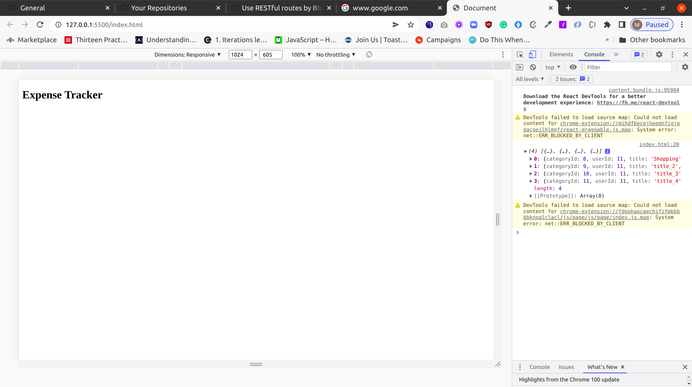

# client-test
Client test site for [expense-tracker-api](https://github.com/Bluette1/expense-tracker-api)


## Table of contents

- [Overview](#overview)
  - [Screenshot](#screenshot)
  - [Links](#links)
- [My process](#my-process)
  - [Built with](#built-with)
  - [What I learned](#what-i-learned)
- [Author](#author)
- [Acknowledgments](#acknowledgments)

## Overview


### Screenshot




### Links

- Solution URL: [Add solution URL here](https://your-solution-url.com)

## My process

### Built with

- HTML5 markup
- Javascript


### What I learned

- Configuring CORS on a Java Spring Boot server API.

Create a corsFilter Bean in `ExpenseTrackerApiApplication.java` as shown below:

```java
	FilterRegistrationBean<CorsFilter> registrationBean = new FilterRegistrationBean<>();
		UrlBasedCorsConfigurationSource source = new UrlBasedCorsConfigurationSource();
		CorsConfiguration config = new CorsConfiguration();
		config.addAllowedOrigin("*");
		config.addAllowedHeader("*");
		source.registerCorsConfiguration("/**", config);
		registrationBean.setFilter(new CorsFilter(source));
		registrationBean.setOrder(0);
		return registrationBean;

```

## Author

- Website - [Marylene Sawyer](http://www.marylene.tech/)
- GitHub - [@Bluette1](https://github.com/Bluette1)
- Twitter - [@MaryleneSawyer](https://twitter.com/MaryleneSawyer)


## Acknowledgments

The tutorial for creating this project can be found [here](https://www.youtube.com/watch?v=5VUjP1wMqoE).
